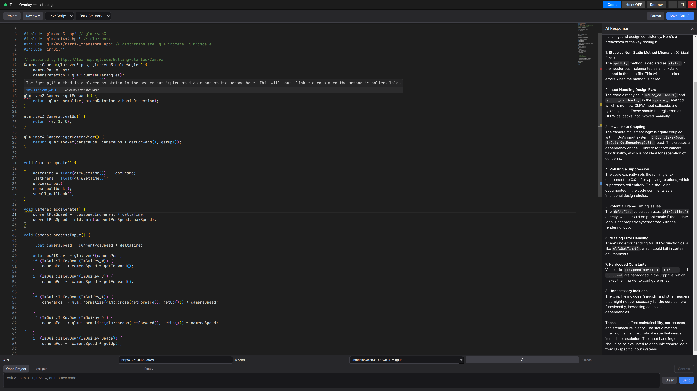
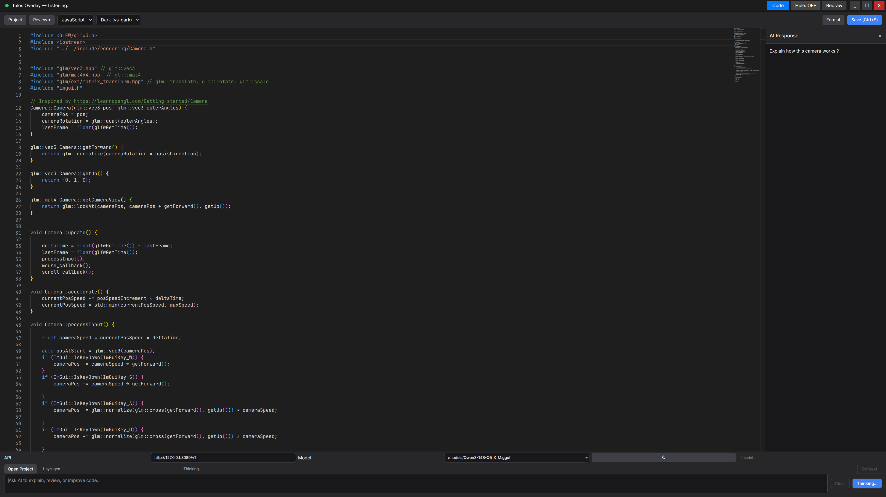
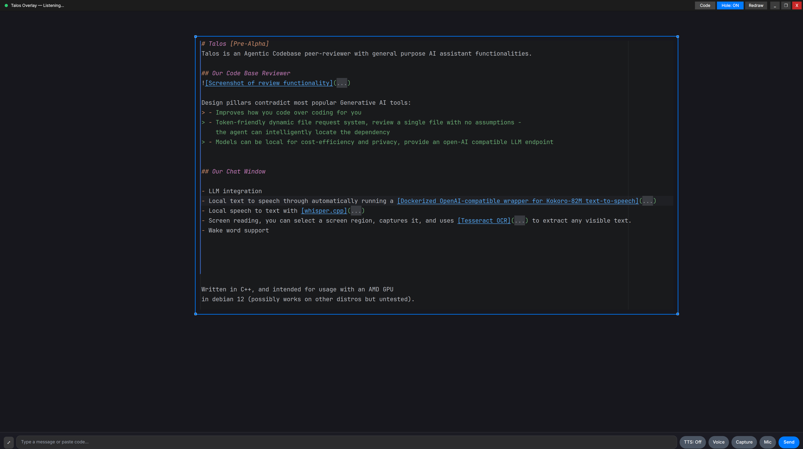
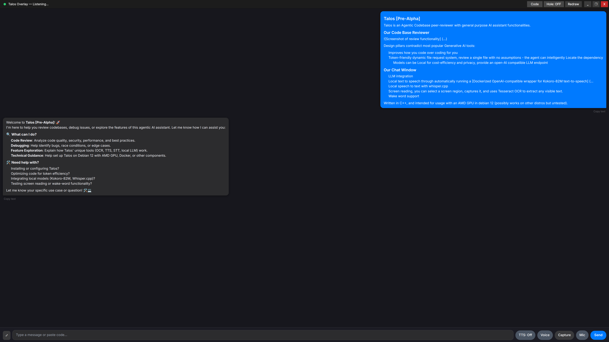

> **Written in C++. Only tested with an AMD GPU in debian 12 with the x11 protocol.**

# Talos [Pre-Alpha]
Talos is an Agentic Codebase peer-reviewer with general purpose AI assistant functionalities. 

Currently conversational capacities are separate from code-review, 
but in the future the primary interaction mechanism will be voice.

Screen-reading will also be integrated into agentic functionalities, at the moment there is only manual usage. 

## Our Code Base Reviewer

Design pillars contradict most popular Generative AI tools:
> - Improves how you code over coding for you
> - Token-friendly dynamic file request system, review a single file with no assumptions -
    the agent can intelligently locate the dependency
> - Models can be local for cost-efficiency and privacy, provide an open-AI compatible LLM endpoint

[Click to view the JSON format to get this response](assets/codebase-aware-prompt.txt)

## Our Chat Window

- LLM integration
- Local text to speech through automatically running a [Dockerized OpenAI-compatible wrapper for Kokoro-82M text-to-speech](https://github.com/remsky/Kokoro-FastAPI)
- Local speech to text with [whisper.cpp](https://github.com/ggml-org/whisper.cpp)
- Screen reading, you can select a screen region, captures it, and uses [Tesseract OCR](https://github.com/tesseract-ocr/tesseract) to extract any visible text.
- [Wake word support](https://github.com/dscripka/openWakeWord) - currently "hey jarvis". 

